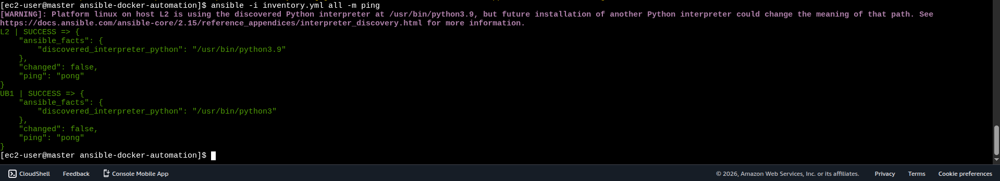
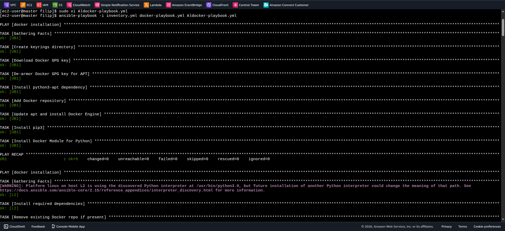
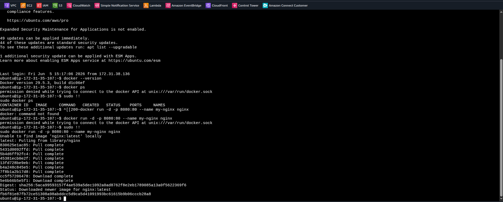
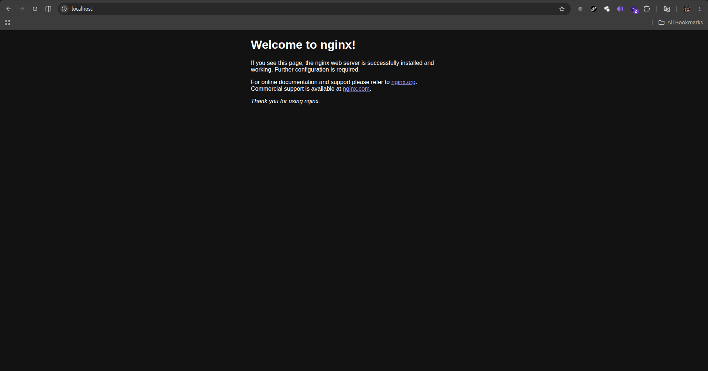

# 🐳 Ansible Docker Automation — Portfolio Project

> A reusable Infrastructure-as-Code project that automates Docker installation across **Ubuntu** and **Amazon Linux 2023** EC2 instances using Ansible.

---

## 📌 Project Overview

This project demonstrates how to provision Docker consistently across different Linux distributions without relying on repetitive manual installation steps.

Ansible runs from a configured master node and connects to AWS EC2 instances over SSH. The inventory groups hosts by operating system, while dedicated playbooks use the appropriate package manager and repository configuration for each platform.

The automation installs Docker Engine, the Docker CLI, containerd, Buildx, Compose, and the Python Docker SDK required for Ansible-based Docker management.

---

## 🏗️ Automation Workflow

```text
┌──────────────────────────────┐
│  Ansible Master Node         │
│  Inventory + Playbooks       │
└──────────────┬───────────────┘
               │ SSH using EC2 key pair
               ▼
      ┌────────────────────┐
      │   inventory.yml    │
      │                    │
      │ ubuntu_nodes       │
      │ amazon_nodes       │
      └─────────┬──────────┘
                │
       ┌────────┴─────────┐
       ▼                  ▼
┌────────────────┐  ┌────────────────────┐
│ Ubuntu EC2     │  │ Amazon Linux 2023  │
│ apt + Docker   │  │ dnf + Docker       │
│ repository     │  │ repository         │
└───────┬────────┘  └──────────┬─────────┘
        │                      │
        └──────────┬───────────┘
                   ▼
        ┌──────────────────────┐
        │ Docker Engine Ready  │
        │ CLI + Compose +      │
        │ Buildx + containerd  │
        └──────────────────────┘
```

---

## 🛠️ Technologies & Services Used

| Technology / Service | Purpose |
|---|---|
| **Ansible** | Automates configuration and software installation on remote hosts |
| **AWS EC2** | Provides the Ubuntu and Amazon Linux 2023 target instances |
| **Ubuntu** | Target platform managed with APT and the Docker APT repository |
| **Amazon Linux 2023** | Target platform managed with DNF and the Docker RPM repository |
| **Docker Engine** | Container runtime installed on each target host |
| **Docker Compose Plugin** | Supports multi-container application definitions |
| **Docker Buildx Plugin** | Provides extended Docker image build capabilities |
| **SSH** | Secure connection between the Ansible master and EC2 instances |
| **Python Docker SDK** | Enables Python and Ansible integrations with Docker |

---

## 📁 Repository Structure

```text
ansible-docker-automation/
├── README.md                 # Project documentation
├── inventory.yml             # EC2 hosts grouped by operating system
├── docker-playbook.yml       # Docker installation playbook for Ubuntu
├── Aldocker-playbook.yml     # Docker installation playbook for Amazon Linux 2023
├── Screenshots/              # Execution and verification evidence
│   ├── Docker service_run.png
│   ├── L2server_ docker.png
│   ├── MasternodeAnsible_ping_check.png
│   ├── MasternodeAnsible_version.png
│   ├── Playbook_run1.png
│   ├── Playbook_run2.png
│   ├── Ubuntuserver_docker.png
│   └── nginx_installation.png
└── ...
```

---

## 🚀 Setup & Deployment

### 1. Install Ansible on the master node

Install Ansible on the machine that will execute the playbooks. The master node must also have network access to the EC2 instances.

### 2. Configure SSH access

Update `inventory.yml` with the correct private-key path, EC2 public or reachable private IP addresses, and remote usernames.

```yaml
all:
  vars:
    ansible_ssh_private_key_file: ~/.ssh/your-key.pem
```

The inventory uses:

- `ubuntu` for Ubuntu instances
- `ec2-user` for Amazon Linux instances

> Do not commit private keys or sensitive infrastructure credentials to the repository.

### 3. Verify Ansible connectivity

From the project directory, test connectivity before installing Docker:

```bash
ansible all -i inventory.yml -m ping
```

### 4. Install Docker on Ubuntu

The Ubuntu playbook creates the APT keyring directory, downloads and converts Docker's GPG key, adds the official Docker repository, and installs Docker packages and the Python Docker module.

```bash
ansible-playbook -i inventory.yml docker-playbook.yml
```

### 5. Install Docker on Amazon Linux 2023

The Amazon Linux playbook configures the DNF repository, adjusts the repository release value for compatibility, installs Docker, enables the service, adds `ec2-user` to the `docker` group, and installs the Python Docker module.

```bash
ansible-playbook -i inventory.yml Aldocker-playbook.yml
```

### 6. Verify Docker on the target hosts

```bash
ansible all -i inventory.yml -a "docker --version"
```

A new login session may be required before a user added to the `docker` group can run Docker commands without `sudo`.

---

## 🌐 Live Demo

This project is infrastructure automation rather than a public web application, so it does not have a public live-demo URL. The included screenshots provide execution and installation evidence from the Ansible master and EC2 target instances.

---

## 📸 Screenshots

| Ansible Connectivity / Version | Playbook Execution | Docker on Ubuntu |
|---|---|---|
| [](Screenshots/MasternodeAnsible_ping_check.png) | [](Screenshots/Playbook_run1.png) | [](Screenshots/Ubuntuserver_docker.png) |

| Docker Service | Docker on Amazon Linux | Additional Installation Evidence |
|---|---|---|
| [](Screenshots/Docker%20service_run.png) | [](Screenshots/L2server_%20docker.png) | [](Screenshots/nginx_installation.png) |

---

## 💡 Key Concepts Learned

- **Infrastructure as Code** — Replacing manual server configuration with repeatable Ansible playbooks
- **Inventory Management** — Grouping hosts by operating system and applying group-specific variables
- **Privilege Escalation** — Using `become: yes` for system-level package and service operations
- **Cross-platform Automation** — Using APT for Ubuntu and DNF for Amazon Linux 2023
- **Package Repository Configuration** — Adding Docker's official repositories and signing keys
- **Idempotent Configuration** — Defining desired system state with Ansible modules such as `file`, `apt`, `dnf`, `user`, and `systemd`
- **SSH-based Administration** — Managing remote EC2 instances securely through an SSH key pair
- **Docker Enablement** — Installing Docker Engine, Compose, Buildx, containerd, and Python integration support

---

## ⚠️ Issues Faced & Fixes

| Problem | Root Cause | Fix Applied |
|---|---|---|
| `curl-minimal` conflict on Amazon Linux 2023 | Package compatibility during Docker dependency installation | Used DNF with `allowerasing: true` so compatible packages could be resolved |
| `$releasever` resolved to an incompatible AL2023 value | The Docker repository expected the CentOS/RHEL 9-compatible release value | Replaced `$releasever` with `9` in the generated repository file |
| Existing Docker repository caused inconsistent configuration | A previous repository file could remain on the host | Removed `/etc/yum.repos.d/docker-ce.repo` before recreating it |
| `python3-apt` missing on fresh Ubuntu hosts | Ansible's APT-related operations require the Python APT bindings | Installed `python3-apt` before continuing with repository and package tasks |
| `externally-managed-environment` on newer Ubuntu versions | System Python package-management restrictions | Used pip's `--break-system-packages` option for the Docker Python module |
| RPM-owned packages blocked pip upgrades on Amazon Linux | Distribution-managed Python packages conflicted with pip behavior | Used pip's `--ignore-installed` option for the Docker module |

---

## 🔮 Future Improvements 

- [ ] Convert the playbooks into a reusable Ansible role with OS-specific defaults
- [ ] Replace hard-coded host IP addresses with configurable variables or dynamic AWS inventory
- [ ] Add Ansible Vault support for sensitive connection data
- [ ] Add Docker service validation and post-installation health checks
- [ ] Add linting with `ansible-lint` and YAML validation in CI
- [ ] Add GitHub Actions for automated syntax checks and quality gates
- [ ] Add a controlled Docker smoke test after installation

---

## 📞 Connect

[](https://linkedin.com/in/alwinroy)
[](https://github.com/AlwinRoy777)
[](https://AlwinRoy777.github.io/Alwin-Portfolio/)

---

⭐ If this project is useful, consider starring the repository.
